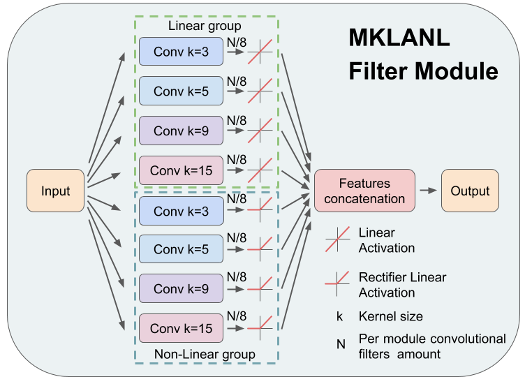
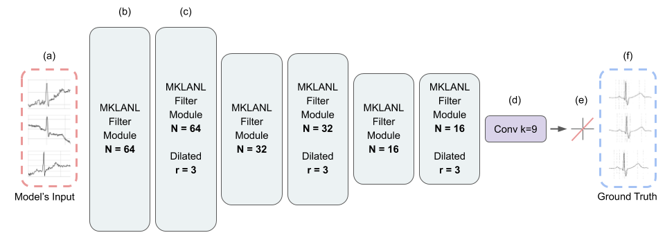
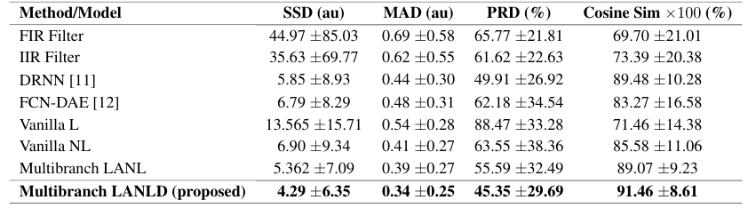
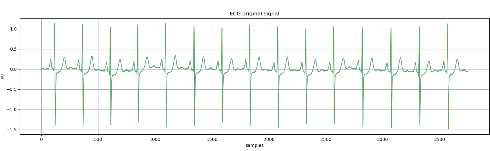
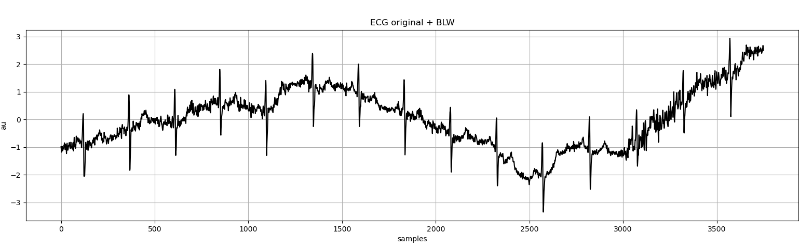
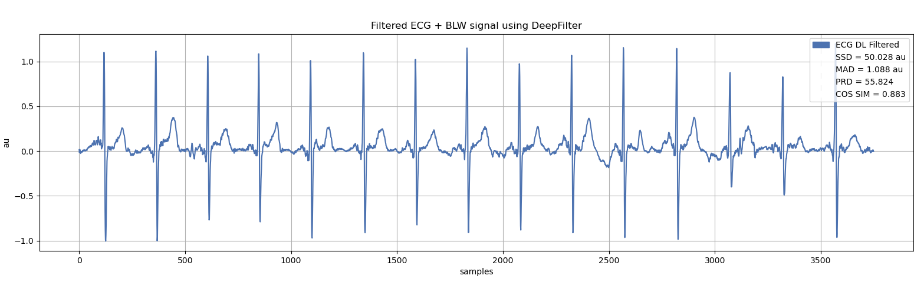
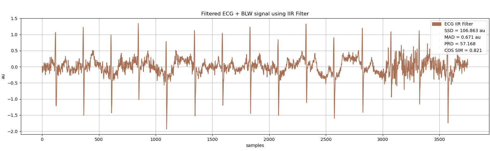

# DeepFilter
For a more theoretical information please visit our paper: [https://arxiv.org/pdf/2101.03423.pdf](https://arxiv.org/pdf/2101.03423.pdf "paper") 

This repository contains the codes for DeepFilter a deep learning based Base line wander removal tool.

This repository also contains other classical and deeplearning filters solutions implemented for comparison purposes.

The models deep learning models were implemented using Keras/Tensorflow framework.

- [Introduction](#introduction)
- [Results](#results)
- [Installation](#installation)
- [References](#references)
- [How to cite DeepFilter](#citing-deepfilter)
- [License](#license)

# Introduction

According to the World Health Organization, around 36% of the annual deaths are associated with cardiovascular 
diseases and 90% of heart attacks are preventable. Electrocardiogram signal analysis in ambulatory electrocardiography, 
during an exercise stress test, and in resting conditions allows cardiovascular disease diagnosis. 
However, during the acquisition, there is a variety of noises that may damage the signal quality thereby compromising 
their diagnostic potential. The baseline wander is one of the most undesirable noises.
 
In this work, we propose a novel algorithm for BLW noise filtering using deep learning techniques. The model performance 
was validated using the QT Database and the MIT-BIH Noise Stress Test Database from Physionet. We implement an Inception 
inspired multibranch model that by laveraging the use og multi path modules and dilated convolutions is capable of 
filtering BLW while preserving ECG signal morphology and been computational efficient.  

The following figure shows the multipath module using dilated convolutions. 

The following figure shows the overall model architecture.

In addition, we compared our approach against state-of-the-art methods using traditional filtering procedures as well as deep learning techniques.
This other methods were implemented by us in python 
* [FIR Filter](https://github.com/fperdigon/DeepFilter/blob/master/digitalFilters/dfilters.py#L17) (using Scipy python library). Reference paper: [Francisco Perdigón Romero, Liset Vázquez Romaguera, Carlos Román Vázquez-Seisdedos, Marly Guimarães Fer-nandes Costa, João Evangelista Neto, et al.  Baseline wander removal methods for ecg signals: A comparativestudy.arXiv preprint arXiv:1807.11359, 2018.](https://arxiv.org/pdf/1807.11359.pdf)
* [IIR Filter](https://github.com/fperdigon/DeepFilter/blob/master/digitalFilters/dfilters.py#L100) (using Scipy python library). Reference paper: [Francisco Perdigón Romero, Liset Vázquez Romaguera, Carlos Román Vázquez-Seisdedos, Marly Guimarães Fer-nandes Costa, João Evangelista Neto, et al.  Baseline wander removal methods for ecg signals: A comparativestudy.arXiv preprint arXiv:1807.11359, 2018.](https://arxiv.org/pdf/1807.11359.pdf)
* [Deep recurrent neural networks (DRRN)](https://github.com/fperdigon/DeepFilter/blob/master/deepFilter/dl_models.py#L511). Reference paper: [Karol Antczak. Deep recurrent neural networks for ecg signal denoising.arXiv preprint arXiv:1807.11551, 2018](https://arxiv.org/pdf/1807.11551.pdf)
* [Full Convolutional Net Denoinsing Autoencoders (FCN-DAE)](https://github.com/fperdigon/DeepFilter/blob/master/deepFilter/dl_models.py#L386). Reference paper: [Hsin-Tien Chiang, Yi-Yen Hsieh, Szu-Wei Fu, Kuo-Hsuan Hung, Yu Tsao, and Shao-Yi Chien. Noise reduction in ecg signals using fully convolutional denoising autoencoders.IEEE Access, 7:60806–60813, 2019.](https://ieeexplore.ieee.org/stamp/stamp.jsp?tp=&arnumber=8693790)

The proposed approach yields the best results on four similarity metrics: the sum of squared distance, maximum absolute square, percentage of root distance, and cosine 
similarity.

## Results

The following table present the quantitative results of DeepFilter Net compared on the same test set with other SOTA 
methods.

Qualitative results

The figure shows a portion of sele0106 ECG signal.

Original ECG + BLW noise from the NSTDB.

The blue line is the ECG filtered using our approach.Metric values are also included.

The brown signal is the ECG recovered using the IIR filter, this image was included for visual comparison purposes. Metric values are also included.

## Reproducibility

For the present work two methods for reproducibility:

### Run DeepFilter on Google Colab

The simplest way to reproduce the published results is by using the Google Colab notebook. The notebook file displays 
all cells results from a previous run. If you want to run the codes by yourself just go to the Google Colab Menu 
"Runtime" then click on "Run all" please be aware that this will take approximately 5 hours.

[Deep Filter Google Colab](https://colab.research.google.com/drive/1S1HjkQnrA0EbEDJFr0D-6DAt62RCcP5_?usp=sharing)

The used Google Colab GPU environment will allow GPU acceleration when training the deep learning models.     
The code will automatically download the data from Pysionet servers and prepare it to be used. Then the different deep 
learning methods will be train. Finally all the results will be computed using the metrics and printed as a table. Due 
the randomness proper of this method the results may differ slightly with the published results.
  
  
### Download this git repository and run local
The firts step is to clone this repository
 
~~~
git clone https://github.com/fperdigon/DeepFilter
~~~

Then lets prepare the dataset.

If you are using Windows open Powershell using the cd command place yourself on  inside the repository folder, then 
execute the download_data.ps1 Powershell script using the command:

~~~
powershell -ExecutionPolicy Bypass -File '.\download_data.ps1'
~~~

If you are using a Unix-like system such as Linux, MacOS, FreeBSD, etc open a console in the path of DeepFilter code, 
then execute the download_data.sh bash file. 

~~~
bash ./download_data.sh
~~~

The next step is to create the Conda environment using the provided environment.yml file. For this step you need the 
conda python package manage installed. In case you don't have it installed we recommend installing 
[Miniconda](https://docs.conda.io/projects/conda/en/latest/user-guide/install/) to avoid installing unnecessary Python 
packages. 

To create the conda environment run the following command:
~~~
conda env create -f environment.yaml
~~~

Then activate the Python environment you just created with the following command:

~~~
conda activate DeepFilter
~~~

Finally start the training and the experiments by running the command:

~~~
python DeepFilter_main.py
~~~

This python script will train all the models, execute the experiments calculate the metrics and plot the result table 
and some figures.

If you have a Nvidia CUDA capable device for GPU acceleration this code will automatically use it (faster). Otherwise the 
training will be done in CPU (slower).   

## Citing DeepFilter

When citing DeepFilter please use this BibTeX entry:
    
TODO: Inset the correct BibTeX once the Arxiv or paper is published  
   
    @article{romero2021deepfilter,
    title={DeepFilter: an ECG baseline wander removal filter using deep learning techniques},
    author={Romero, Francisco Perdig{\'o}n and Pi{\~n}ol, David Castro and V{\'a}zquez-Seisdedos, Carlos Rom{\'a}n},
    journal={arXiv preprint arXiv:2101.03423},
    year={2021}
    }
    
## License

The MIT License (MIT)

Copyright (c) 2021 Francisco Perdigon Romero, David Castro Piñol

Permission is hereby granted, free of charge, to any person obtaining a copy
of this software and associated documentation files (the "Software"), to deal
in the Software without restriction, including without limitation the rights
to use, copy, modify, merge, publish, distribute, sublicense, and/or sell
copies of the Software, and to permit persons to whom the Software is
furnished to do so, subject to the following conditions:

The above copyright notice and this permission notice shall be included in all
copies or substantial portions of the Software.

THE SOFTWARE IS PROVIDED "AS IS", WITHOUT WARRANTY OF ANY KIND, EXPRESS OR
IMPLIED, INCLUDING BUT NOT LIMITED TO THE WARRANTIES OF MERCHANTABILITY,
FITNESS FOR A PARTICULAR PURPOSE AND NONINFRINGEMENT. IN NO EVENT SHALL THE
AUTHORS OR COPYRIGHT HOLDERS BE LIABLE FOR ANY CLAIM, DAMAGES OR OTHER
LIABILITY, WHETHER IN AN ACTION OF CONTRACT, TORT OR OTHERWISE, ARISING FROM,
OUT OF OR IN CONNECTION WITH THE SOFTWARE OR THE USE OR OTHER DEALINGS IN THE
SOFTWARE.
